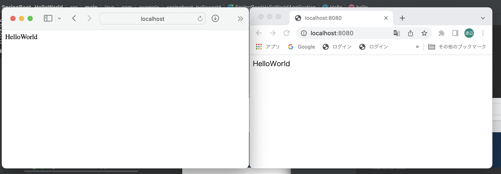

# 第３回　課題
## 課題内容
### WebアプリケーションをAPサーバー上で動作させて、画面上に「Hello World」と表示させてみましょう。
## Spring initializr
- ~~Maven~~  Gradle Project
- Java
- 2.6.7
- Java11
- Dependencies spring web
## 出力確認

## 修正内容
- レポジトリ名を小文字に修正しました。
- パッケージ名を変更しました。
- RestControllerを使用し、HelloControllerを別クラスに配置しました。
- RequestMappingをGetMappingに置き換えました。
- フォルダの誤字を修正しました。
# 追加
- README.md内のProjectに誤りがあった為修正しました。
- HelloController.Java内戻り値の表記の修正しました。
